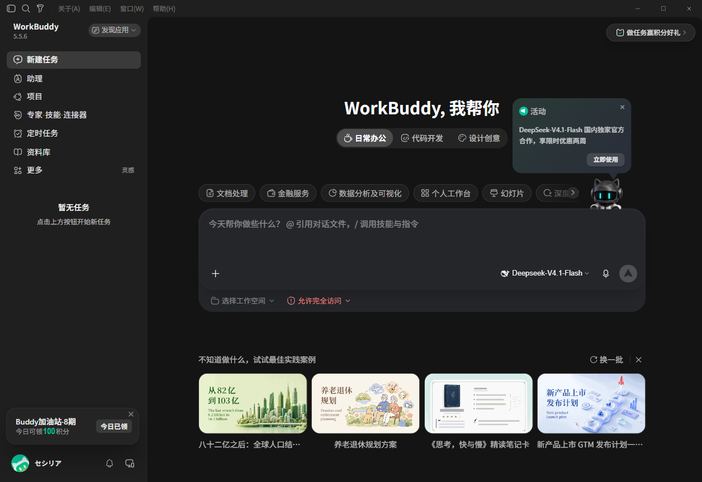
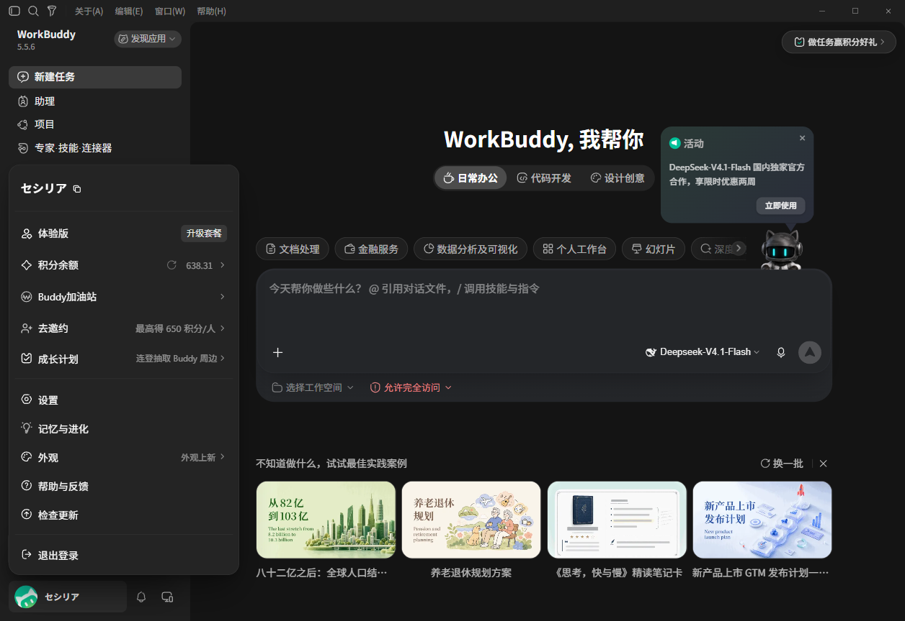
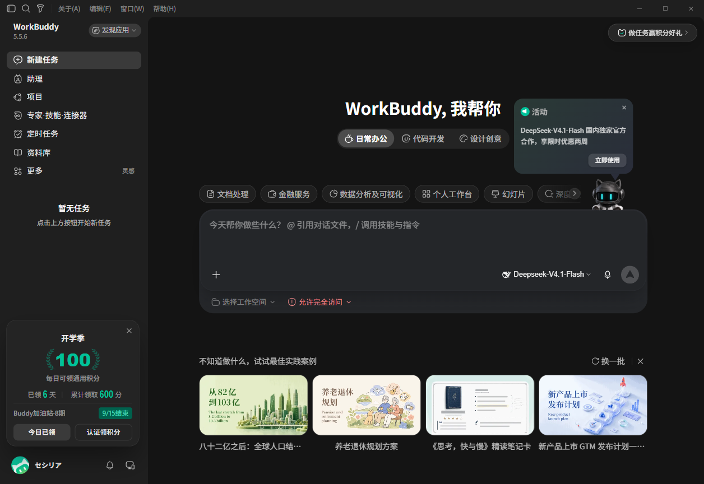

# WorkBuddy 每日签到 — CDP DOM 操控

## 设想

WorkBuddy 是 Electron（Chromium）套壳。启动时加 `--remote-debugging-port`，即可用 Playwright 通过 CDP 接管其渲染进程，直接读/点 DOM 完成签到。

## 环境（2026-09-14 实测）

| 项 | 值 |
|---|---|
| 应用 | WorkBuddy 5.5.6 |
| 运行时 | Electron 37.10.3 / Chrome 138.0.7204.251 |
| 工具 | `@playwright/cli` 0.1.19（npm 全局） |
| CLI 路径 | `%APPDATA%\npm\playwright-cli.cmd`（若 PATH 无 `playwright-cli` 用全路径） |
| CDP | `http://127.0.0.1:9222` |

结论：**方案可行**。下表选择器已实测；日常直接点 selector，不必 `find` / 不必用 `eXXX` ref。

## 稳定选择器（实操确认）

| 操作 | 命令 | 说明 |
|---|---|---|
| 附加 | `attach --cdp=http://127.0.0.1:9222` | 接管已启动实例，不是 `open` |
| 打开账户菜单 | `click "[data-track-id=user_avatar_menu]"` | **实测可点** |
| 进入加油站 | `click "#fuel-menu-label"` | 菜单入口 |
| 点今日领取 | `click "#fuel-expanded-claim"` | 仅 `disabled=false` 时 |
| 认证入口 | `click "#fuel-action"` | 「认证领积分」 |
| 截图 | `screenshot --filename=<abs-path>` | 建议写绝对路径 |

| 元素 | selector | 备注 |
|---|---|---|
| 头像按钮 | `[data-track-id=user_avatar_menu]` | 优先用这个；`.user-menu-trigger` 曾因动画 stability 点击超时 |
| 菜单入口「Buddy加油站」 | `#fuel-menu-label` | |
| 「去邀约」 | `#fuel-menu-invite-label` | |
| 紧凑卡片 | `section.fuel-card.fuel-compact` | |
| 紧凑领取钮 | `#fuel-compact-claim` | 主界面头像旁 |
| 展开卡片 | `section.fuel-card.fuel-expanded` | |
| 活动标题 | `#fuel-title-expanded` | |
| 期次 | `#fuel-period` | |
| 今日领取 | `#fuel-expanded-claim` | 今日已领时 `disabled=true` |
| 认证领积分 | `#fuel-action` | |

**不要用：**

- 快照 ref（`e84` / `e101`…）— 每次 attach 都变
- 头像 `id`（形如 `:r1m:`）— React 自动生成，重启会变
- 裸 `document.querySelector('#fuel-...')` — 节点在 **Shadow DOM** 内，普通查询找不到

## 查领取状态（必须穿透 Shadow DOM）

Playwright 的 `click "#fuel-..."` 会自动穿透；`page.evaluate` 里的 `document.querySelector` **不会**。

```bash
playwright-cli eval "() => {
  const visit = (root) => {
    if (!root || !root.querySelectorAll) return null;
    const el = root.querySelector('#fuel-expanded-claim');
    if (el) return el;
    for (const n of root.querySelectorAll('*')) {
      if (n.shadowRoot) {
        const r = visit(n.shadowRoot);
        if (r) return r;
      }
    }
    return null;
  };
  const el = visit(document);
  return el ? { text: el.textContent, disabled: el.disabled } : null;
}"
```

期望（今日已领时）：`{"text":"今日已领","disabled":true}`

## 定位 WorkBuddy.exe（pwsh 动态路径）

```powershell
function Get-WorkBuddyExe {
    $roots = @(
        $env:LOCALAPPDATA
        $env:ProgramFiles
        ${env:ProgramFiles(x86)}
    ) | Where-Object { $_ }

    foreach ($r in $roots) {
        $p = if ($r -eq $env:LOCALAPPDATA) {
            Join-Path $r 'Programs\WorkBuddy\WorkBuddy.exe'
        } else {
            Join-Path $r 'WorkBuddy\WorkBuddy.exe'
        }
        if (Test-Path -LiteralPath $p) { return (Resolve-Path -LiteralPath $p).Path }
    }

    foreach ($r in $roots) {
        $prefix = if ($r -eq $env:LOCALAPPDATA) { Join-Path $r 'Programs' } else { $r }
        if (-not (Test-Path -LiteralPath $prefix)) { continue }
        $hit = Get-ChildItem -Path $prefix -Filter 'WorkBuddy.exe' -Recurse -ErrorAction SilentlyContinue |
            Select-Object -First 1
        if ($hit) { return $hit.FullName }
    }

    throw 'WorkBuddy.exe not found.'
}
```

## 操作流水（完整可复制）

在**本仓库目录**执行；截图用绝对路径，避免写到别的 cwd。

```powershell
# 0) 先粘贴上面的 Get-WorkBuddyExe 函数，然后：
$WorkBuddyExe = Get-WorkBuddyExe
$CDPPort = 9222
$Cli = Join-Path $env:APPDATA 'npm\playwright-cli.cmd'
$Out = (Get-Location).Path

Get-Process WorkBuddy -ErrorAction SilentlyContinue | Stop-Process -Force
Start-Sleep -Seconds 2
Start-Process -FilePath $WorkBuddyExe -ArgumentList "--remote-debugging-port=$CDPPort"
Start-Sleep -Seconds 6
Invoke-WebRequest "http://127.0.0.1:$CDPPort/json/version" -UseBasicParsing

# 阶段1：附加 + 主界面
& $Cli attach --cdp="http://127.0.0.1:$CDPPort"
& $Cli screenshot --filename="$Out\workbuddy-cdp.png"

# 阶段2：账户菜单
& $Cli click "[data-track-id=user_avatar_menu]"
& $Cli screenshot --filename="$Out\workbuddy-account-menu.png"

# 阶段3：加油站面板
& $Cli click "#fuel-menu-label"
& $Cli screenshot --filename="$Out\buddy-fuel-panel.png"
```

等价 bash（`playwright-cli` 需在 PATH）：

```bash
playwright-cli attach --cdp=http://127.0.0.1:9222
playwright-cli screenshot --filename="$PWD/workbuddy-cdp.png"

playwright-cli click "[data-track-id=user_avatar_menu]"
playwright-cli screenshot --filename="$PWD/workbuddy-account-menu.png"

playwright-cli click "#fuel-menu-label"
playwright-cli screenshot --filename="$PWD/buddy-fuel-panel.png"
```

领取（仅当穿透 eval 返回 `disabled:false`）：

```bash
playwright-cli click "#fuel-expanded-claim"
```

## Shadow DOM

加油站在 shadow root 内（宿主 class 含 `wb-slot--menu-signin` / `wb-slot--closable-content`）。

- Playwright `click "#fuel-..."`：自动穿透，可用
- `page.evaluate` + `document.querySelector`：**不可用**，必须遍历 `shadowRoot`

## 实机结果（2026-09-14，三阶段）

**阶段 1 — attach 后主界面**：



**阶段 2 — 账户菜单**：



**阶段 3 — 加油站面板**：



- `#fuel-expanded-claim` =「今日已领」`disabled=true`（未再点）
- `#fuel-action` =「认证领积分」可点（未点击）

## 限制

- 必须带 `--remote-debugging-port` 启动；普通启动连不上
- 应用重启后需重新 attach
- 端口默认 9222，改端口要同步改 attach URL
- selector 若改版失效，用 snapshot + shadow 穿透重定位
